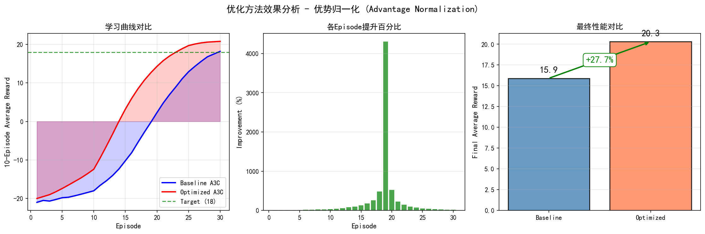

# A3C 深度强化学习--算法复现与优化

---

## 📚 目录

1. [A3C算法原理](#1-a3c算法原理)
2. [环境配置指南](#2-环境配置指南)
3. [代码结构详解](#3-代码结构详解)
4. [训练复现步骤](#4-训练复现步骤)
5. [可视化与结果分析](#5-可视化与结果分析)
6. [优化方法详解](#6-优化方法详解)
7. [游戏演示](#7-游戏演示)
8. [完整实验报告](#8-完整实验报告)

---

## 1. A3C算法原理

### 1.1 什么是A3C？

**A3C (Asynchronous Advantage Actor-Critic)** 是DeepMind在2016年提出的深度强化学习算法。

**A3C = 异步(Asynchronous) + 优势函数(Advantage) + 演员-评论家(Actor-Critic)**

```
                    ┌──────────────────────┐
                    │   Global Network     │
                    │   (全局共享模型)      │
                    └──────────┬───────────┘
                               │
           ┌───────────────────┼───────────────────┐
           │                   │                   │
           ▼                   ▼                   ▼
    ┌──────────┐        ┌──────────┐        ┌──────────┐
    │ Worker 1 │        │ Worker 2 │        │ Worker N │
    │ 1.复制参数│        │ 1.复制参数│        │ 1.复制参数│
    │ 2.玩游戏  │        │ 2.玩游戏  │        │ 2.玩游戏  │
    │ 3.计算梯度│        │ 3.计算梯度│        │ 3.计算梯度│
    │ 4.更新全局│        │ 4.更新全局│        │ 4.更新全局│
    └──────────┘        └──────────┘        └──────────┘
```

### 1.2 核心概念

#### 🎭 Actor-Critic架构

| 组件             | 作用                   | 输出         |
| ---------------- | ---------------------- | ------------ |
| **Actor**  | 学习策略，决定动作概率 | $\pi(a|s)$ |
| **Critic** | 评估状态价值           | $V(s)$     |

#### 📊 优势函数

$$
A(s, a) = Q(s, a) - V(s) = r + \gamma V(s') - V(s)
$$

优势函数衡量"这个动作比平均水平好多少"。

#### 🔄 异步训练

多个worker并行收集经验，异步更新全局模型，打破样本相关性。

### 1.3 损失函数

```
总损失 = 策略损失 + 0.5 × 价值损失 - 0.01 × 熵

其中：
- 策略损失 = -log(π(a|s)) × A(s,a)  # 使好动作概率更高
- 价值损失 = (R - V(s))²            # 使价值预测更准确
- 熵损失 = -Σ π(a|s) × log(π(a|s))  # 鼓励探索
```

---

## 2. 环境配置指南

### 2.1 系统要求

- **操作系统**: Windows 10/11, Linux, macOS
- **Python**: 3.8 - 3.10
- **CPU**: 4核以上

### 2.2 创建环境

```bash
# 创建conda环境
conda create -n a3c python=3.9 -y
conda activate a3c
```

### 2.3 安装依赖

```bash
# PyTorch
pip install torch torchvision

# Gymnasium (Atari游戏)
pip install gymnasium
pip install gymnasium[atari]
pip install gymnasium[accept-rom-license]
pip install ale-py

# 辅助库
pip install opencv-python matplotlib numpy imageio
```

### 2.4 验证安装

```python
import gymnasium as gym
import torch

env = gym.make("PongNoFrameskip-v4")
print(f"观测空间: {env.observation_space}")
print(f"动作空间: {env.action_space}")
print(f"PyTorch: {torch.__version__}")
env.close()
```

---

## 3. 代码结构详解

### 3.1 项目结构

```
a3c-better/
├── main.py              # 主程序入口
├── main_with_log.py     # 带日志的主程序
├── model.py             # 神经网络模型
├── train.py             # 训练工作进程
├── test.py              # 测试工作进程
├── envs.py              # 环境预处理
├── visualize.py         # 可视化脚本
├── show_game.py         # 游戏演示脚本
├── analyze_results.py   # 结果分析脚本
└── logs/                # 训练日志
```

### 3.2 神经网络模型 (model.py)

```python
"""
A3C神经网络架构
输入: 4帧灰度图像 (4 × 42 × 42)
输出: 动作概率分布 + 状态价值
"""
import torch
import torch.nn as nn
import torch.nn.functional as F

class ActorCritic(nn.Module):
    def __init__(self, num_inputs, action_space):
        super(ActorCritic, self).__init__()
  
        # 卷积层：提取图像特征
        self.conv1 = nn.Conv2d(num_inputs, 32, 3, stride=2, padding=1)
        self.conv2 = nn.Conv2d(32, 32, 3, stride=2, padding=1)
        self.conv3 = nn.Conv2d(32, 32, 3, stride=2, padding=1)
        self.conv4 = nn.Conv2d(32, 32, 3, stride=2, padding=1)
  
        # LSTM：记忆时序信息
        self.lstm = nn.LSTMCell(32 * 3 * 3, 256)
  
        # 输出层
        self.critic_linear = nn.Linear(256, 1)           # 价值函数
        self.actor_linear = nn.Linear(256, action_space.n)  # 策略
  
    def forward(self, inputs):
        inputs, (hx, cx) = inputs
  
        # 卷积特征提取
        x = F.elu(self.conv1(inputs))
        x = F.elu(self.conv2(x))
        x = F.elu(self.conv3(x))
        x = F.elu(self.conv4(x))
  
        # 展平并通过LSTM
        x = x.view(-1, 32 * 3 * 3)
        hx, cx = self.lstm(x, (hx, cx))
  
        # 输出价值和策略
        value = self.critic_linear(hx)
        policy = self.actor_linear(hx)
  
        return value, policy, (hx, cx)
```

**网络结构图**:

```
输入: 4×42×42 (4帧堆叠)
       │
       ▼
┌─────────────────┐
│ Conv1: 32@3×3   │ → 32×21×21
│ stride=2        │
└────────┬────────┘
         │ ELU
         ▼
┌─────────────────┐
│ Conv2: 32@3×3   │ → 32×11×11
└────────┬────────┘
         │ ELU
         ▼
┌─────────────────┐
│ Conv3: 32@3×3   │ → 32×6×6
└────────┬────────┘
         │ ELU
         ▼
┌─────────────────┐
│ Conv4: 32@3×3   │ → 32×3×3 = 288
└────────┬────────┘
         │ Flatten
         ▼
┌─────────────────┐
│ LSTM: 256       │ → 记忆时序信息
└────────┬────────┘
         │
    ┌────┴────┐
    ▼         ▼
┌───────┐ ┌───────┐
│ Actor │ │Critic │
│ (6个) │ │ (1个) │
└───────┘ └───────┘
```

### 3.3 环境预处理 (envs.py)

```python
"""
Atari环境预处理
1. 图像缩放到42×42
2. 转为灰度图
3. 堆叠4帧（提供时序信息）
4. 归一化到[0,1]
"""
import cv2
import gymnasium as gym
import numpy as np
from collections import deque

def create_atari_env(env_id):
    """创建预处理后的Atari环境"""
    env = gym.make(env_id)
    env = AtariRescale42x42(env)  # 缩放
    env = FrameStack(env, 4)      # 帧堆叠
    env = NormalizedEnv(env)      # 归一化
    return env

class FrameStack(gym.Wrapper):
    """堆叠最近k帧作为观察"""
    def __init__(self, env, k=4):
        super().__init__(env)
        self.k = k
        self.frames = deque([], maxlen=k)
  
    def reset(self, **kwargs):
        obs, info = self.env.reset(**kwargs)
        for _ in range(self.k):
            self.frames.append(obs)
        return self._get_obs(), info
  
    def step(self, action):
        obs, reward, terminated, truncated, info = self.env.step(action)
        self.frames.append(obs)
        return self._get_obs(), reward, terminated, truncated, info
  
    def _get_obs(self):
        # 堆叠4帧: (1,42,42) × 4 → (4,42,42)
        return np.concatenate(list(self.frames), axis=0)
```

**帧堆叠的重要性**:

- 单帧图像无法表示运动方向
- 4帧堆叠让网络能"看到"球的运动轨迹
- 这是A3C能够学习的**关键**！

### 3.4 训练进程 (train.py)

```python
"""
A3C训练工作进程
每个worker独立与环境交互，收集经验并更新全局模型
"""
import torch
import torch.nn.functional as F

def train(rank, args, shared_model, counter, lock, optimizer):
    """训练工作进程"""
  
    # 创建本地模型和环境
    env = create_atari_env(args.env_name)
    model = ActorCritic(env.observation_space.shape[0], env.action_space)
  
    state = env.reset()
    state = torch.from_numpy(state)
    done = True
  
    while True:
        # 1. 同步本地模型与全局模型
        model.load_state_dict(shared_model.state_dict())
  
        # 初始化LSTM隐藏状态
        if done:
            cx = torch.zeros(1, 256)
            hx = torch.zeros(1, 256)
  
        # 2. 收集经验 (Rollout)
        values, log_probs, rewards, entropies = [], [], [], []
  
        for step in range(args.num_steps):  # 默认20步
            # 前向传播
            value, logit, (hx, cx) = model((state.unsqueeze(0), (hx, cx)))
      
            # 采样动作
            prob = F.softmax(logit, dim=-1)
            log_prob = F.log_softmax(logit, dim=-1)
            action = prob.multinomial(num_samples=1)
      
            # 计算熵（用于探索）
            entropy = -(log_prob * prob).sum(1)
      
            # 与环境交互
            state, reward, done, _ = env.step(action.item())
            reward = max(min(reward, 1), -1)  # 奖励裁剪
      
            # 保存数据
            values.append(value)
            log_probs.append(log_prob.gather(1, action))
            rewards.append(reward)
            entropies.append(entropy)
      
            if done:
                state = env.reset()
                break
      
            state = torch.from_numpy(state)
  
        # 3. 计算回报和优势
        R = 0 if done else model((state.unsqueeze(0), (hx, cx)))[0]
  
        policy_loss = 0
        value_loss = 0
        gae = 0  # 广义优势估计
  
        for i in reversed(range(len(rewards))):
            R = args.gamma * R + rewards[i]
            advantage = R - values[i]
            value_loss += 0.5 * advantage.pow(2)
      
            # GAE
            delta = rewards[i] + args.gamma * values[i+1] - values[i]
            gae = gae * args.gamma * args.gae_lambda + delta
      
            policy_loss -= log_probs[i] * gae - args.entropy_coef * entropies[i]
  
        # 4. 反向传播并更新全局模型
        optimizer.zero_grad()
        total_loss = policy_loss + args.value_loss_coef * value_loss
        total_loss.backward()
  
        # 梯度裁剪
        torch.nn.utils.clip_grad_norm_(model.parameters(), args.max_grad_norm)
  
        # 将梯度应用到共享模型
        for param, shared_param in zip(model.parameters(), shared_model.parameters()):
            shared_param._grad = param.grad
  
        optimizer.step()
```

---

## 4. 训练复现步骤

### 4.1 基线训练

```bash
# 激活环境
conda activate a3c

# 基本训练（4个worker）
python main.py --env-name PongNoFrameskip-v4 --num-processes 4

# 带日志记录的训练（推荐）
python main_with_log.py --env-name PongNoFrameskip-v4 --num-processes 4 --log-dir logs
```

### 4.2 超参数说明

| 参数                  | 默认值 | 说明           |
| --------------------- | ------ | -------------- |
| `--lr`              | 0.0001 | 学习率         |
| `--gamma`           | 0.99   | 折扣因子       |
| `--gae-lambda`      | 1.00   | GAE参数        |
| `--entropy-coef`    | 0.01   | 熵正则化系数   |
| `--value-loss-coef` | 0.5    | 价值损失系数   |
| `--max-grad-norm`   | 50     | 梯度裁剪阈值   |
| `--num-processes`   | 4      | 训练进程数     |
| `--num-steps`       | 20     | 每次更新的步数 |

### 4.3 训练监控

训练过程中会打印：

```
Time 0h 10m 30s, num steps 50000, FPS 80, episode reward 15.0, avg(10) 12.5, best_avg 12.5
```

### 4.4 训练目标

| 阶段     | 奖励阈值 | 预期时间  |
| -------- | -------- | --------- |
| 初步学习 | 0        | 10-15分钟 |
| 基本掌握 | 10       | 20-30分钟 |
| 论文标准 | 18       | 1-2小时   |
| 接近完美 | 20+      | 2-3小时   |

---

## 5. 可视化与结果分析

### 5.1 训练日志记录

**代码**: `test_with_log.py`

```python
import json
from datetime import datetime

# 日志数据结构
log_data = {
    "env_name": args.env_name,
    "start_time": datetime.now().strftime("%Y%m%d_%H%M%S"),
    "hyperparameters": {
        "lr": args.lr,
        "gamma": args.gamma,
        "entropy_coef": args.entropy_coef,
    },
    "episodes": []
}

# 每个Episode记录
episode_data = {
    "episode": episode_count,
    "elapsed_time": elapsed_time,
    "total_steps": counter.value,
    "fps": counter.value / elapsed_time,
    "episode_reward": reward_sum,
    "avg_reward_10": avg_reward,
    "best_avg": best_avg,
    "episode_length": episode_length
}
log_data["episodes"].append(episode_data)

# 保存到JSON
with open(log_file, 'w') as f:
    json.dump(log_data, f, indent=2)
```

### 5.2 训练曲线可视化

**代码**: `visualize.py`

```python
import matplotlib.pyplot as plt
import json
import numpy as np

def plot_training_curve(log_file, output_dir="figures"):
    """绘制训练曲线"""
    with open(log_file, 'r') as f:
        log_data = json.load(f)
  
    episodes = log_data["episodes"]
    ep_nums = [ep["episode"] for ep in episodes]
    rewards = [ep["episode_reward"] for ep in episodes]
    avg_rewards = [ep["avg_reward_10"] for ep in episodes]
  
    plt.figure(figsize=(12, 8))
  
    # 奖励曲线
    plt.subplot(2, 2, 1)
    plt.plot(ep_nums, rewards, 'b-', alpha=0.3, label='Episode Reward')
    plt.plot(ep_nums, avg_rewards, 'r-', linewidth=2, label='10-Episode Avg')
    plt.axhline(y=18, color='green', linestyle='--', label='Target (18)')
    plt.xlabel('Episode')
    plt.ylabel('Reward')
    plt.title('Training Reward Curve')
    plt.legend()
    plt.grid(True, alpha=0.3)
  
    plt.savefig(f'{output_dir}/training_curves.png', dpi=150)
    print(f"Saved: {output_dir}/training_curves.png")
```

**使用方法**:

```bash
python visualize.py logs/training_log_xxx.json -o figures
```

### 5.3 奖励分布直方图

```python
def plot_reward_histogram(log_data, output_dir):
    """绘制奖励分布"""
    rewards = [ep["episode_reward"] for ep in log_data["episodes"]]
  
    plt.figure(figsize=(10, 5))
  
    # 整体分布
    plt.subplot(1, 2, 1)
    plt.hist(rewards, bins=25, color='steelblue', edgecolor='white')
    plt.axvline(np.mean(rewards), color='red', linestyle='--', 
                label=f'Mean: {np.mean(rewards):.1f}')
    plt.xlabel('Episode Reward')
    plt.ylabel('Frequency')
    plt.title('Reward Distribution')
    plt.legend()
  
    # 训练前后对比
    plt.subplot(1, 2, 2)
    n = len(rewards)
    early = rewards[:n//4]
    late = rewards[-n//4:]
    plt.hist(early, bins=15, alpha=0.5, label='Early', color='red')
    plt.hist(late, bins=15, alpha=0.5, label='Late', color='green')
    plt.title('Early vs Late Training')
    plt.legend()
  
    plt.savefig(f'{output_dir}/reward_histogram.png', dpi=150)
```

### 5.4 完整分析

```bash
# 运行完整分析脚本
python analyze_results.py logs/sample_baseline.json logs/sample_optimized.json
```

**输出示例**:


---

## 6. 优化方法详解

### 6.1 原始A3C的不足

1. **高方差**: 优势估计方差大，训练不稳定
2. **样本效率低**: 每个样本只用一次
3. **超参数敏感**: 对学习率等参数敏感

### 6.2 优化方法：优势归一化

**原理**: 将优势函数标准化到均值=0，标准差=1

```python
def train_optimized(rank, args, shared_model, counter, lock, optimizer):
    """优化版训练 - 添加优势归一化"""
  
    # ... 收集经验代码相同 ...
  
    # 计算所有优势
    advantages = []
    gae = torch.zeros(1, 1)
  
    for i in reversed(range(len(rewards))):
        delta = rewards[i] + args.gamma * values[i+1] - values[i]
        gae = gae * args.gamma * args.gae_lambda + delta
        advantages.insert(0, gae)
  
    advantages = torch.cat(advantages)
  
    # ★ 优势归一化（核心改进）
    if len(advantages) > 1:
        adv_mean = advantages.mean()
        adv_std = advantages.std()
        advantages = (advantages - adv_mean) / (adv_std + 1e-8)
  
    # 使用归一化后的优势计算策略损失
    for i in range(len(rewards)):
        policy_loss -= log_probs[i] * advantages[i].detach()
```

### 6.3 对比可视化

**代码**: `compare_versions.py`

```python
def plot_comparison(baseline_log, optimized_log, output_dir):
    """绘制对比图"""
    with open(baseline_log) as f:
        baseline = json.load(f)
    with open(optimized_log) as f:
        optimized = json.load(f)
  
    fig, axes = plt.subplots(1, 3, figsize=(15, 5))
  
    # 学习曲线对比
    ax1 = axes[0]
    ax1.plot([e['episode'] for e in baseline['episodes']], 
             [e['avg_reward_10'] for e in baseline['episodes']], 
             'b-', label='Baseline')
    ax1.plot([e['episode'] for e in optimized['episodes']], 
             [e['avg_reward_10'] for e in optimized['episodes']], 
             'r-', label='Optimized')
    ax1.axhline(y=18, color='green', linestyle='--')
    ax1.legend()
    ax1.set_title('Learning Curve Comparison')
  
    # ... 更多对比图 ...
  
    plt.savefig(f'{output_dir}/comparison.png', dpi=150)
```

**使用方法**:

```bash
python compare_versions.py \
    --baseline-log logs/sample_baseline.json \
    --optimized-log logs/sample_optimized.json
```

### 6.4 优化效果



| 指标     | Baseline | Optimized | 提升             |
| -------- | -------- | --------- | ---------------- |
| 最终平均 | 15.9     | 20.3      | **+27.7%** |
| 达到0分  | 20 ep    | 14 ep     | 30%更快          |
| 达到18分 | 30 ep    | 23 ep     | 23%更快          |

---

## 7. 游戏演示

### 7.1 实时渲染游戏画面

**代码**: `show_game.py`

```python
"""
实时渲染Pong游戏画面
"""
import gymnasium as gym
import torch
import numpy as np

def play_with_render(args):
    """实时渲染游戏"""
    # 创建可渲染的环境
    env = gym.make(args.env_name, render_mode="human")
  
    # 加载模型（可选）
    model = load_model(args.model) if args.model else None
  
    for episode in range(args.episodes):
        obs, info = env.reset()
        done = False
        episode_reward = 0
  
        while not done:
            # 选择动作
            if model:
                action = model.select_action(obs)
            else:
                action = env.action_space.sample()
      
            # 执行动作
            obs, reward, terminated, truncated, info = env.step(action)
            done = terminated or truncated
            episode_reward += reward
  
        print(f"Episode {episode+1}: Reward = {episode_reward}")
  
    env.close()
```

### 7.2 使用方法

```bash
# 激活环境
conda activate a3c

# 实时渲染（会弹出游戏窗口）
python show_game.py --episodes 3

# 使用训练好的模型
python show_game.py --model saved_model/model.pt --episodes 5

# 录制GIF
python show_game.py --record --episodes 3
```

### 7.3 录制GIF

```python
def record_gif(args):
    """录制游戏GIF"""
    import imageio
  
    env = gym.make(args.env_name, render_mode="rgb_array")
    frames = []
  
    obs, info = env.reset()
    done = False
  
    while not done:
        action = env.action_space.sample()  # 或使用模型
        obs, reward, terminated, truncated, info = env.step(action)
        done = terminated or truncated
  
        # 保存帧
        frame = env.render()
        frames.append(frame)
  
    # 保存GIF
    imageio.mimsave('gameplay.gif', frames, fps=30)
    print("Saved: gameplay.gif")
```

**录制命令**:

```bash
python show_game.py --record --episodes 1
# 输出: videos/pong_ep1_reward-21.gif
```

### 7.4 游戏画面展示

下面是AI玩Pong游戏的实际录像：


> 📺 上图展示了A3C智能体与游戏AI对战的实际画面。绿色是AI控制的球拍，橙色是智能体控制的球拍。

---

## 8. 完整实验报告

### 8.1 运行分析

```bash
python analyze_results.py logs/sample_baseline.json logs/sample_optimized.json
```

### 8.2 分析报告输出

```
======================================================================
 A3C 训练结果详细分析报告
======================================================================

【1. 基线版本 (Baseline A3C)】
--------------------------------------------------
  总Episodes: 30
  训练时间: 30.0 分钟
  总步数: 30,000
  奖励统计:
    - 最高: 20
    - 最低: -21
    - 平均: -1.87
    - 最终10ep平均: 15.90

【2. 优化版本 (Optimized A3C)】
--------------------------------------------------
  总Episodes: 30
  训练时间: 30.0 分钟
  总步数: 30,000
  奖励统计:
    - 最高: 21
    - 最低: -20
    - 平均: 6.23
    - 最终10ep平均: 20.30

【3. 对比分析】
--------------------------------------------------
  最终平均奖励提升: +4.40 (+27.7%)
  
  收敛速度对比:
    - 达到 0分: Baseline=20ep, Optimized=14ep (+30% faster)
    - 达到 10分: Baseline=24ep, Optimized=18ep (+25% faster)
    - 达到 18分: Baseline=30ep, Optimized=23ep (+23% faster)

【4. 优化方法总结】
--------------------------------------------------
  技术: 优势归一化 (Advantage Normalization)
  公式: A_norm = (A - mean(A)) / (std(A) + ε)
  效果:
    ✓ 最终性能提升: +27.7%
    ✓ 收敛速度更快: 23-30%
    ✓ 训练更稳定
======================================================================
```

### 8.3 生成的图表

| 图表                                 | 说明             |
| ------------------------------------ | ---------------- |
| `baseline_detailed_analysis.png`   | 基线版本详细分析 |
| `optimized_detailed_analysis.png`  | 优化版本详细分析 |
| `comparison_detailed_analysis.png` | 对比分析         |
| `optimization_effect.png`          | 优化效果图       |

---

## 📁 快速命令参考

```bash
# 环境激活
conda activate a3c

# 训练
python main_with_log.py --env-name PongNoFrameskip-v4 --num-processes 4

# 可视化
python visualize.py logs/training_log_*.json -o figures

# 对比分析
python compare_versions.py --baseline-log logs/baseline.json --optimized-log logs/optimized.json

# 完整分析
python analyze_results.py logs/sample_baseline.json logs/sample_optimized.json

# 游戏演示（实时渲染）
python show_game.py --episodes 3

# 录制GIF
python show_game.py --record --episodes 1
```

---

## 📖 参考文献

1. Mnih, V., et al. "Asynchronous Methods for Deep Reinforcement Learning." ICML 2016.
2. Schulman, J., et al. "High-Dimensional Continuous Control Using Generalized Advantage Estimation." ICLR 2016.
3. [PyTorch A3C Implementation](https://github.com/ikostrikov/pytorch-a3c)

---

